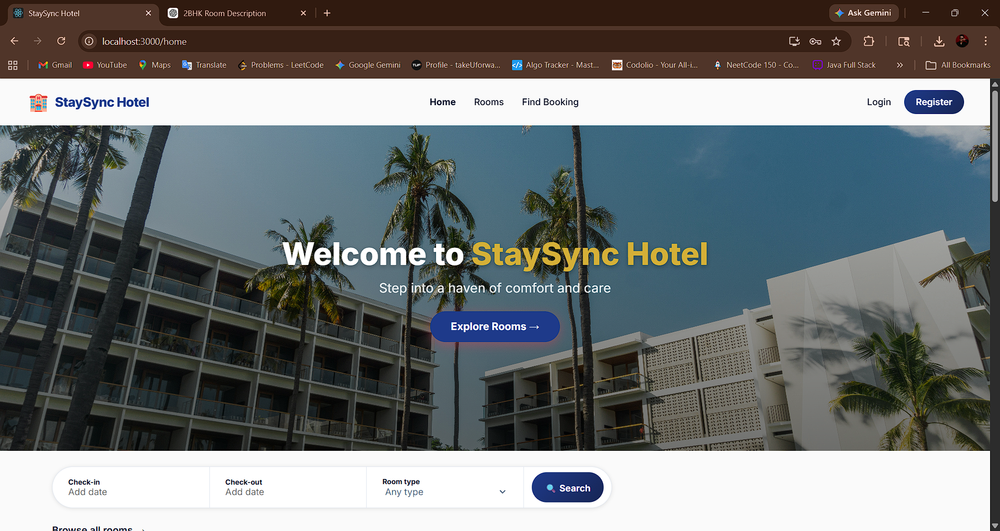
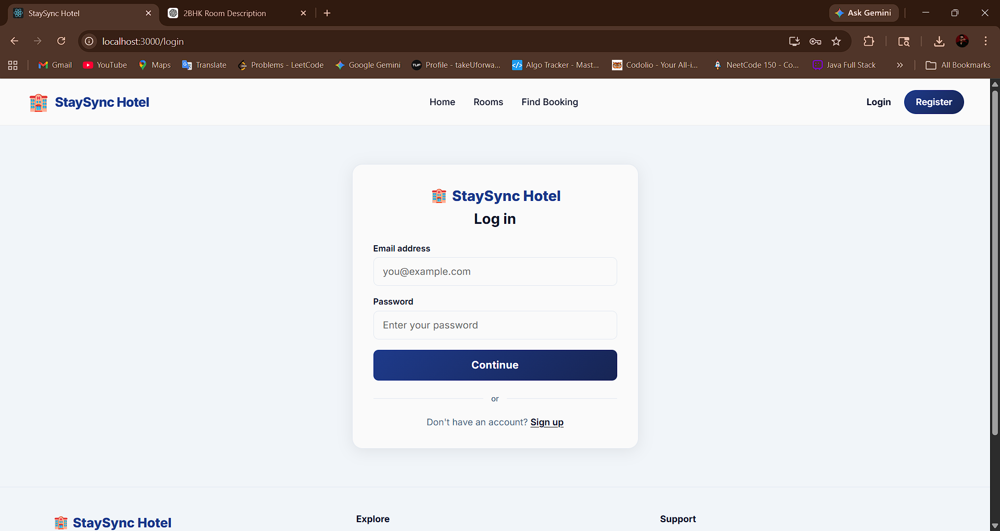
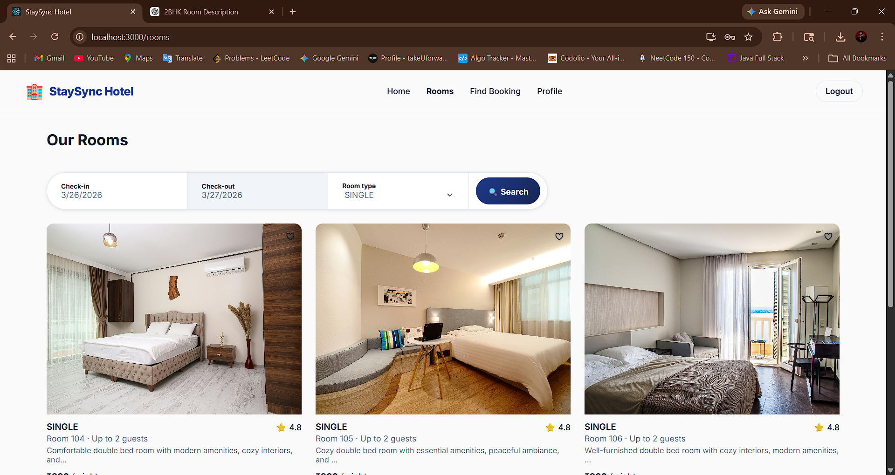
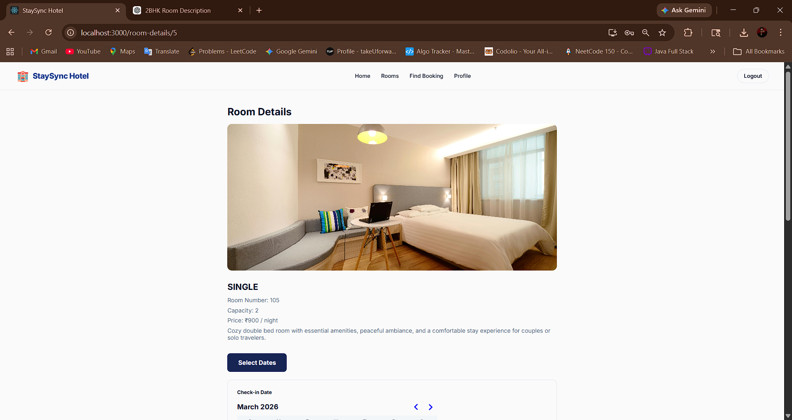
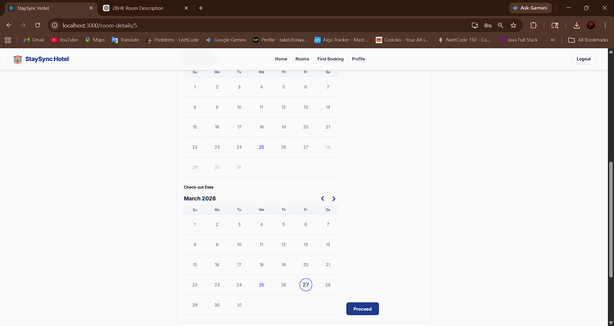
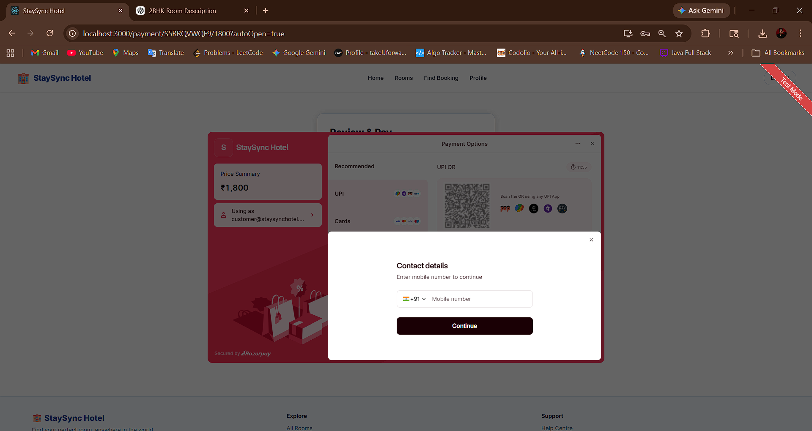

# 🏨 StaySync Hotel – Full Stack Hotel Booking System

StaySync Hotel is a **full-stack hotel booking application** built with a strong focus on **backend development, API design, and secure payment processing**. The system allows users to browse rooms, make bookings, complete payments, and receive automated email notifications, while admins can manage rooms and reservations efficiently.

---

## ✨ Key Highlights

* 🔹 Spring Boot Backend (Core Focus)
* 🔹 RESTful API Architecture
* 🔹 JWT Authentication & Authorization
* 🔹 Razorpay Payment Integration (End-to-End)
* 🔹 Java Mail Sender (Email Automation)
* 🔹 Full Frontend-Backend Integration
* 🔹 Real-world Booking Workflow Implementation

---

## 🧠 System Architecture

React Frontend → Spring Boot REST API → Database
↓
Razorpay Payment Gateway

---

## 🛠 Tech Stack

### 🔹 Backend (Main Focus 🚀)

* Language: Java
* Framework: Spring Boot
* Architecture: RESTful APIs
* Security: JWT Authentication & Authorization
* Database: MySQL
* Build Tool: Maven
* Payment Integration: Razorpay
* Email Service: Java Mail Sender

---

### 🔹 Frontend

* Framework: React.js
* Routing: react-router-dom
* HTTP Client: Axios
* State Management: React Hooks
* UI Design: Glassmorphism + Modern Animations

---

## 🔐 Backend Features

* ✅ User Authentication & Authorization

  * JWT-based login & registration
  * Role-based access (Admin / User)

* ✅ Room Management APIs

  * Add, update, delete rooms
  * Fetch available rooms

* ✅ Booking System APIs

  * Create booking
  * Fetch booking details
  * Booking status management

* ✅ Payment Integration (Razorpay)

  * Order creation via backend
  * Secure payment processing
  * Payment status update
  * Failure handling

* ✅ Email Notification System (Java Mail Sender)

  * Payment link sent after booking
  * Booking confirmation email after payment
  * Automated user communication

* ✅ Secure API Design

  * Token-based request validation
  * Protected endpoints

---

## 💳 Payment & Email Flow

1. User selects room and dates (Frontend)
2. Frontend calls backend booking API
3. Backend creates Razorpay order
4. Payment link is sent to user via email
5. Frontend opens Razorpay Checkout
6. User completes payment
7. Backend verifies payment
8. Booking confirmation email is sent

---

## 🌐 Frontend Features

* Room browsing & filtering
* Booking flow with date selection
* Razorpay payment UI
* JWT-based authentication
* Admin dashboard
* Booking search via confirmation code

---
## 📸 Application Workflow (Frontend UI)

### 🏠 Home Page


### 🛏️ Room Listing


### 📅 Booking Page


### 💳 Payment Page


### ⏳ Payment Timer / Processing


### ✅ Booking Confirmation


---

## 🚀 Installation & Setup

### 🔹 Backend (Spring Boot)

```bash
cd backend
mvn clean install
mvn spring-boot:run
```

Runs on:
http://localhost:7070/api

---

### 🔹 Frontend (React)

```bash
cd frontend
npm install
npm start
```

Runs on:
http://localhost:3000

---

## 🔐 Environment Variables

### Backend

```
RAZORPAY_KEY_ID=your_key
RAZORPAY_SECRET=your_secret
JWT_SECRET=your_jwt_secret
MAIL_USERNAME=your_email
MAIL_PASSWORD=your_email_password
```

---

### Frontend

```
REACT_APP_RAZORPAY_KEY_ID=your_public_key
```

---

## 🗂 Project Structure

```
hotel-booking-app/
│
├── frontend/        # React UI
├── backend/         # Spring Boot APIs
├── README.md
└── .gitignore
```

---

## 🧠 What Makes This Project Strong

* ✔ Real-world payment integration (Razorpay)
* ✔ Complete backend-driven architecture
* ✔ Secure JWT authentication system
* ✔ Email automation using Java Mail Sender
* ✔ Clean separation of frontend & backend
* ✔ Production-like API design

---

## 🎯 Use Case

This project simulates a real hotel booking platform demonstrating:

* Authentication systems
* Booking workflows
* Payment processing
* Email notifications
* Admin operations

---

## 📄 License

This project is built for learning and demonstration purposes.
